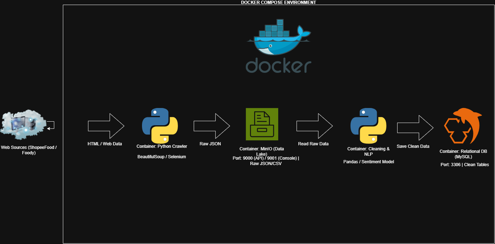

# Project ADY201m - ShopeeFood & Foody Sentiment Analysis

## 1. System Architecture

* **Crawler Container**: Đóng gói script thu thập dữ liệu đánh giá từ ShopeeFood & Foody.
* **MinIO Object Storage**: Lưu trữ dữ liệu thô (Raw Data).
* **NLP Processing**: Làm sạch dữ liệu và phân tích cảm xúc (Sentiment Analysis).
* **MySQL Database**: Lưu trữ dữ liệu đã xử lý.
